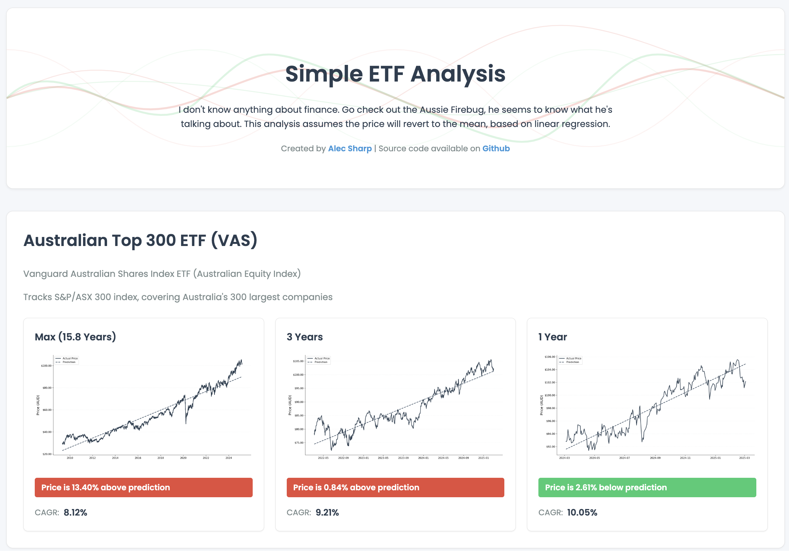

# Simple ETF Analysis

A simple ETF analysis tool that visualizes price trends using linear regression. This tool helps identify when ETF prices might be above or below their historical trend lines.

## Live Demo

You can try out the tool at <TODO>



## Disclaimer

I don't know anything about finance. Go check out the Aussie Firebug, he seems to know what he's talking about. This analysis assumes the price will revert to the mean, based on linear regression.

## Getting Started

```bash
git clone https://github.com/alecsharpie/etf.git
cd etf
uv sync
uv run main.py
```

### How it works

- Fetches historical price data for Australian ETFs using Yahoo Finance
- Performs linear regression analysis over different time periods:
  - 20 year period (if available)
  - 3 year period
  - 1 year period
- Calculates Compound Annual Growth Rate (CAGR) for each period
- Shows whether current prices are above or below the predicted trend line
- Visualizes the data with interactive plots

## Technical Details

The application is built using:
- Python with FastHTML for the web interface
- yfinance for fetching ETF data
- scikit-learn for linear regression analysis
- matplotlib for data visualization
- Pandas for data manipulation

## Creator

Built by [Alec Sharp](https://www.alecsharpie.me/)

## License

[MIT](LICENSE)